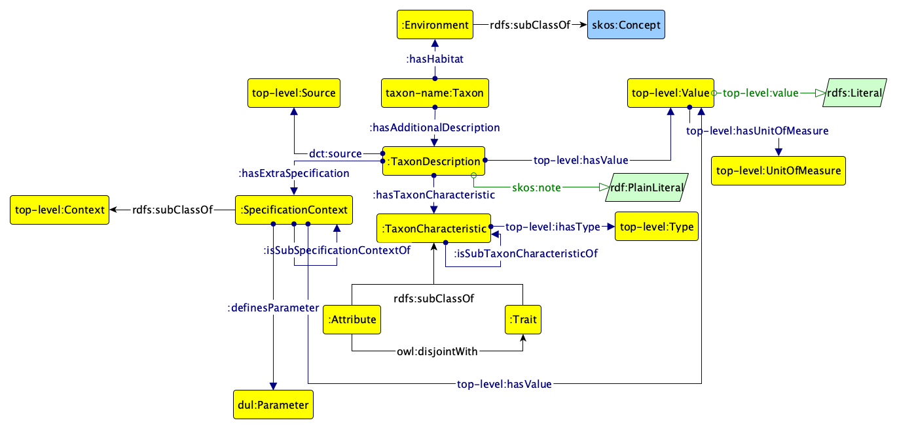

# Attribute and Trait ontology of the APHIA ontology network

This is the ontology for attribute and trait of the species beloging to the APHIA network of ontologies. The modelling takes into account the current available data in the WoRMS system.

The following image illustrates in the graphical notation offered by Graffoo the preliminary proposed model for the distribution.

The latest directory includes always the latest version of the ontology.

The ontologies have been developed in the context of the Work Package 3, coordinated by Italian National Research Council (CNR), of the EU-funded MAREGRAPH project coordinated by VLIZ.
