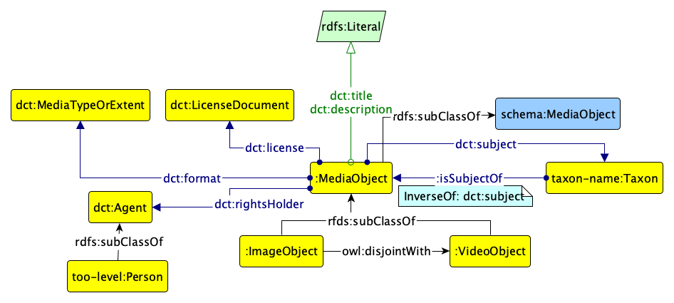

# Media ontology of the MAREGRAPH ontology network

This is the ontology of the MAREGRAPH network that represents media (image objects, video objects, other types of media) associated with the species.

The following image illustrates, in the graphical notation offered by Graffoo the preliminary proposed model for the distribution.

The latest directory includes always the latest version of the ontology.
