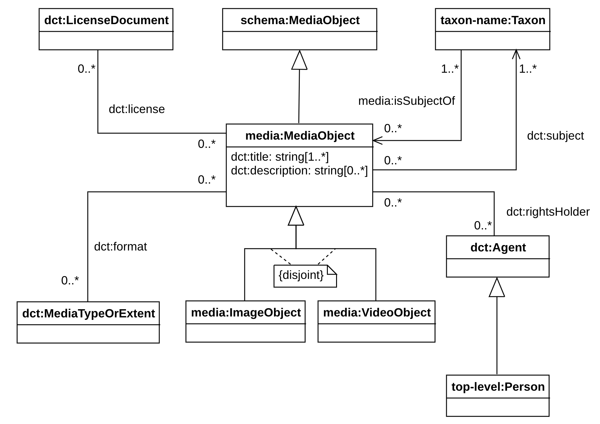

# Media ontology of the APHIA ontology network

This is the ontology of the APHIA network that represents media (image objects, video objects, other types of media) associated with the species.

The following image illustrates, in the graphical notation offered by Graffoo the preliminary proposed model for the distribution.

The same diagram in UML is depicted in the following image.

The latest directory includes always the latest version of the ontology.

The ontologies have been developed in the context of the Work Package 3, coordinated by Italian National Research Council (CNR), of the EU-funded MAREGRAPH project coordinated by VLIZ.
