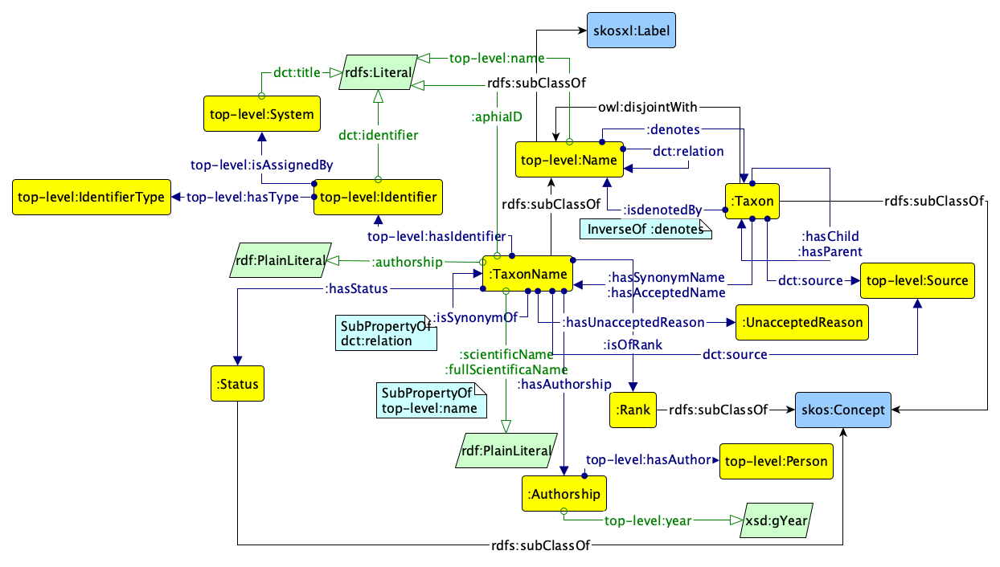
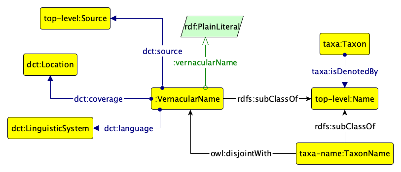

# Taxa name ontology of the MAREGRAPH ontology network

This is the taxa name ontology of the MAREGRAPH network of ontologies. It represents both taxon names and vernacular names and all the taxonomic information.

The ontology is illustrated by the two graffoo diagrams below.

The latest directory includes always the latest version of the ontology.
