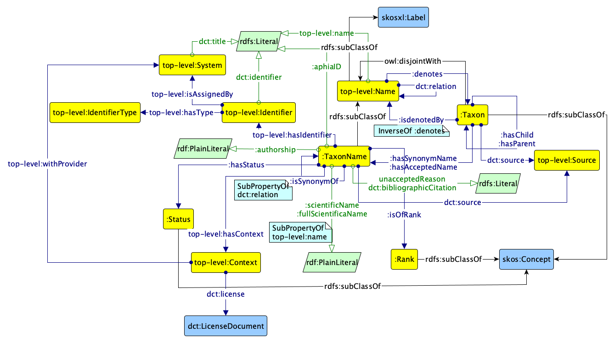

# Taxon name ontology of the APHIA ontology network

This is the taxon name ontology of the APHIA network of ontologies. It represents both taxon names and vernacular names and all the taxonomic information.

The ontology is illustrated by the two graffoo diagrams below.

The latest directory includes always the latest version of the ontology.

The ontologies have been developed in the context of the Work Package 3, coordinated by Italian National Research Council (CNR), of the EU-funded MAREGRAPH project coordinated by VLIZ.
